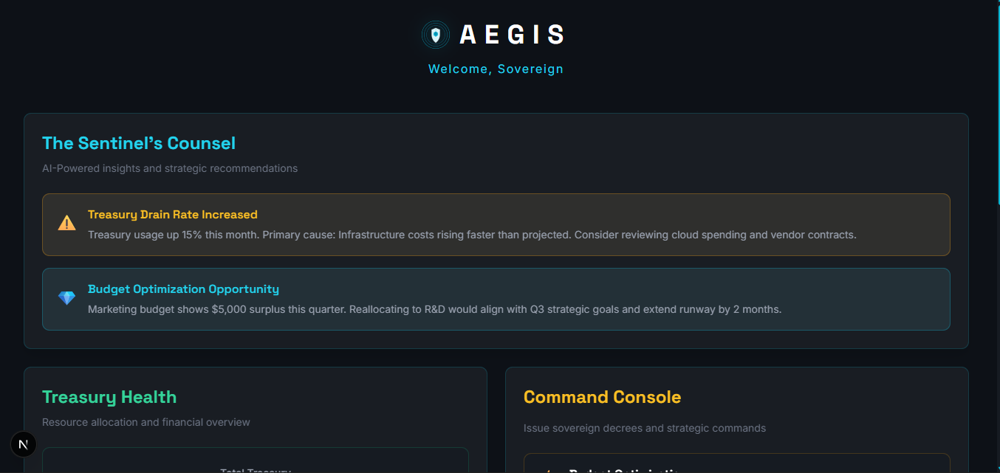
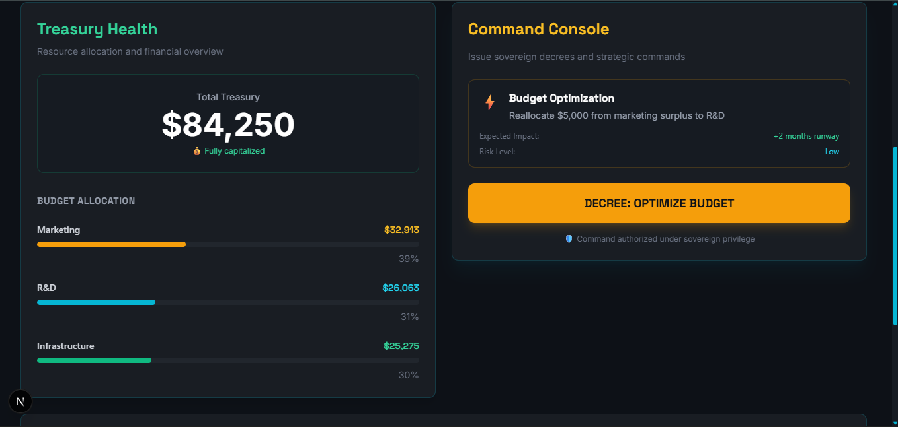
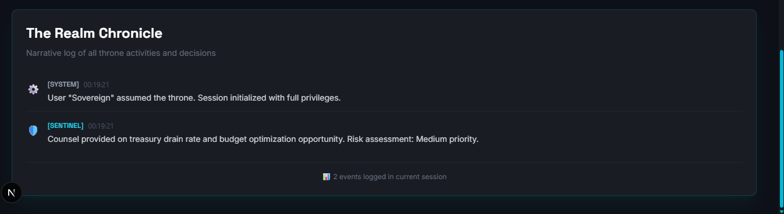
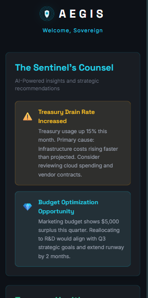

<div align="center">
  
  
  # 🦅 Project Aegis - Throne
  
  ### *A Sovereign Command System for Modern Leaders*
  
  **Transform chaotic dashboards into intelligent strategy centers**
  
  [](https://vercel.com)
  [](https://nextjs.org/)
  [](https://supabase.com/)
  
  [🚀 Live Demo](#) • [📖 Documentation](#documentation) • [🗺️ Roadmap](#roadmap)
  
  ---
  
  
  
  
  
  
  
</div>

<br />

> **"You don't want to be a data analyst. You want to be a leader."**

---

## 🎯 What is Throne?

**Throne is not a dashboard. It's a throne room.**

Where other tools show you charts and hope you figure it out, Throne provides clear counsel, enables one-click commands, and turns all activity into a clear story. It's the difference between _watching_ your kingdom and _ruling_ it.

### The Transformation

**Before Throne:** You are an **Administrator**  
You drown in tabs, spreadsheets, and alerts. You are reactive, stressed, and your tools work against you. You are _watching_.

**After Throne:** You are a **Sovereign**  
You have a clear view of your realm, a trusted counselor in your ear, and the power to act with purpose. You are _commanding_.

**Throne doesn't give you more data. It gives you more command.**

---

## ✨ Core Features

### 🏛️ The Throne (Interface)

A glassmorphic command center with four strategic panels:

#### 📊 Treasury Panel

Real-time financial oversight with intelligent budget visualization

- Live total treasury value
- Dynamic budget allocation bars (Marketing, R&D, Infrastructure)
- Percentage-based visual indicators
- Automatic updates via Supabase real-time subscriptions

#### ⚔️ Command Panel

One-click strategic execution with intelligent state management

- **Execute Strategic Decree** - Reallocates 15% from Marketing to R&D
- Smart button states (Ready → Processing → Executed)
- Visual feedback with hover effects and animations
- Prevention of duplicate executions

#### 📜 Chronicle Panel

Session-based event logging with narrative clarity

- Auto-scrolling event feed
- Timestamp-based entries
- Clear, sovereign-toned language
- Real-time activity tracking

#### 🛡️ Sentinel Panel

AI-powered intelligence cards (static insights in MVP)

- Alert notifications (amber-themed)
- Opportunity highlights (cyan-themed)
- Strategic recommendations
- Hover interactions for emphasis

---

## 🛠️ Tech Stack

### Core Framework

- **Next.js 15** - React framework with App Router
- **React 19** - UI library with latest features
- **TypeScript** - Type-safe development

### Styling & Animation

- **Tailwind CSS** - Utility-first styling with custom glassmorphism
- **Framer Motion** - Smooth animations and transitions

### State & Data

- **Zustand** - Lightweight state management
- **Supabase** - PostgreSQL database with real-time subscriptions
  - Real-time updates via WebSocket
  - Row Level Security (disabled for MVP)

### Development

- **Turbo** - Monorepo build system
- **ESLint** - Code quality
- **PostCSS** - CSS processing

---

## 🚀 Getting Started

### Prerequisites

- Node.js 18+
- npm/yarn/pnpm
- Supabase account

### Installation

1. **Clone the repository**

```bash
git clone git@github.com:Eagle-lucid/aegis-project.git
cd aegis-project
```

2. **Install dependencies**

```bash
npm install
# or
pnpm install
```

3. **Set up environment variables**

Create `apps/throne/.env.local`:

```env
NEXT_PUBLIC_SUPABASE_URL=your_supabase_project_url
NEXT_PUBLIC_SUPABASE_ANON_KEY=your_supabase_anon_key
```

4. **Set up Supabase database**

Run this SQL in your Supabase SQL Editor:

```sql
-- Create treasury table
CREATE TABLE treasury (
  id INTEGER PRIMARY KEY,
  total DECIMAL NOT NULL,
  marketing DECIMAL NOT NULL,
  rd DECIMAL NOT NULL,
  infrastructure DECIMAL NOT NULL,
  updated_at TIMESTAMPTZ DEFAULT NOW()
);

-- Insert initial data
INSERT INTO treasury (id, total, marketing, rd, infrastructure)
VALUES (1, 84250, 37913, 21063, 25275);

-- Enable real-time
ALTER PUBLICATION supabase_realtime ADD TABLE treasury;
```

5. **Run the development server**

```bash
npm run dev
# or
pnpm dev
```

6. **Open Throne**
   Navigate to `http://localhost:3000`

---

## 🏗️ Architecture

### Component Hierarchy

```
app/page.tsx (Main Throne Room)
└── components/
    ├── layouts/
    │   └── GlassLayout.tsx (Glassmorphic container)
    └── panels/
        ├── TreasuryPanel.tsx (Financial overview)
        ├── CommandPanel.tsx (Strategic actions)
        ├── ChroniclePanel.tsx (Event logging)
        └── SentinelPanel.tsx (AI insights)
```

### Data Flow

1. **Real-time Updates**

```
Supabase (PostgreSQL)
    ↓ (Real-time subscription)
TreasuryPanel Component
    ↓ (State update)
UI Re-render with animations
```

2. **Command Execution**

```
User clicks "Execute Strategic Decree"
    ↓
CommandPanel validates state
    ↓
Supabase UPDATE query
    ↓
Real-time subscription triggers
    ↓
Treasury updates automatically
    ↓
Chronicle logs the event
```

### State Management

- **Zustand** - Global decree execution state
- **React Hooks** - Component-level state (useState, useEffect)
- **Custom Hooks** - `useChronicle` for event logging

### Real-time Mechanics

Throne uses Supabase's real-time subscriptions:

```typescript
// Automatic treasury updates
supabase
  .channel("treasury-changes")
  .on(
    "postgres_changes",
    { event: "UPDATE", schema: "public", table: "treasury" },
    (payload) => setTreasury(payload.new)
  )
  .subscribe();
```

---

## 🎨 Design Philosophy

### Glassmorphism Aesthetic

- Frosted glass panels with backdrop blur
- Subtle borders and shadows
- Depth through layering
- Dark theme optimized

### Color System

- **Cyan** (#06b6d4) - Opportunities, highlights
- **Amber** (#f59e0b) - Alerts, warnings
- **Emerald** (#10b981) - Success, growth
- **Slate/Zinc** - Neutral backgrounds

### Animation Principles

- **Purposeful** - Every animation conveys state
- **Smooth** - 300-700ms durations with easing
- **Feedback** - Hover, click, and state transitions
- **Performance** - GPU-accelerated transforms

---

## 📁 Project Structure

```
apps/throne/
├── app/
│   ├── page.tsx              # Main throne room interface
│   ├── layout.tsx            # Root layout with metadata
│   └── globals.css           # Tailwind imports + custom styles
├── components/
│   ├── layouts/
│   │   └── GlassLayout.tsx   # Reusable glass container
│   ├── panels/
│   │   ├── TreasuryPanel.tsx # Financial overview panel
│   │   ├── CommandPanel.tsx  # Strategic decree execution
│   │   ├── ChroniclePanel.tsx # Event logging panel
│   │   └── SentinelPanel.tsx # AI insights panel
│   └── ui/
│       ├── BudgetBar.tsx     # Animated budget visualization
│       ├── ChronicleEntry.tsx # Individual log entry
│       ├── InsightCard.tsx   # Sentinel insight card
│       └── GlassPanel.tsx    # Base glass panel component
├── lib/
│   ├── supabase.ts           # Supabase client configuration
│   ├── useChronicle.ts       # Chronicle hook for event logging
│   └── utils.ts              # Utility functions
├── public/                   # Static assets (logo placeholder)
├── package.json
├── tsconfig.json
├── tailwind.config.ts        # Tailwind + glassmorphism config
└── next.config.js
```

---

## 🚢 Deployment

### Vercel Deployment

1. **Connect to Vercel**

```bash
vercel
```

2. **Set environment variables in Vercel Dashboard**

- `NEXT_PUBLIC_SUPABASE_URL`
- `NEXT_PUBLIC_SUPABASE_ANON_KEY`

3. **Deploy**

```bash
vercel --prod
```

### Database Setup

Ensure your Supabase project has:

- ✅ Treasury table created
- ✅ Real-time enabled on treasury table
- ✅ Initial data seeded (id=1 row)
- ⚠️ RLS disabled (for MVP - enable for production)

---

## 🗺️ Roadmap

### Phase 1: MVP (Current)

- ✅ Real-time treasury monitoring
- ✅ Strategic decree execution
- ✅ Event chronicle logging
- ✅ Static AI insights
- ✅ Glassmorphic UI
- ✅ Responsive design

### Phase 2: Intelligence

- [ ] Dynamic Sentinel insights (AI-powered)
- [ ] Anomaly detection
- [ ] Predictive analytics
- [ ] Custom alert thresholds

### Phase 3: Commands

- [ ] Multiple decree types
- [ ] Custom command builder
- [ ] Approval workflows
- [ ] Scheduled executions

### Phase 4: Multi-Realm

- [ ] Multiple treasury support
- [ ] Cross-realm analytics
- [ ] Collaborative governance
- [ ] Role-based permissions

---

## 🧠 Philosophy

**Aegis is built on a simple belief:**

Leaders shouldn't be data analysts. They should be strategists.

Every feature in Throne is designed to answer three questions:

1. **What's happening?** (Treasury Panel)
2. **What should I do?** (Sentinel + Commands)
3. **What did I do?** (Chronicle)

The interface doesn't just show information—it tells a story. The language isn't technical—it's sovereign. The actions aren't complex—they're decisive.

**This is not software. This is a throne.**

---

## 📖 Documentation

- **[ARCHITECTURE.md](./ARCHITECTURE.md)** - Technical deep-dive and design decisions
- **[DEVELOPMENT.md](./DEVELOPMENT.md)** - Local development and contribution guide
- **[DEPLOYMENT.md](./DEPLOYMENT.md)** - Production deployment instructions
- **[schema.sql](./schema.sql)** - Database schema

---

## 📄 License

MIT License - see [LICENSE](./LICENSE) file for details.

Copyright (c) 2025 Lucid the Eagle

## 🤝 Contributing

Currently in closed MVP phase. Open-source roadmap TBD.

---

## 📧 Contact

For beta access, partnerships, or inquiries:

<!-- Email -  -->
<!-- LinkedIn -->
<!-- Github -->
<!-- Reddit -->
<!-- X (Twitter) -->

---

**Built with sovereignty. Shipped with purpose.** 🦅👑
